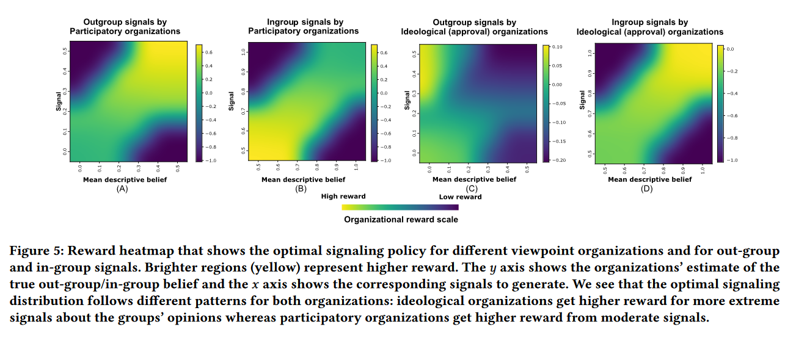
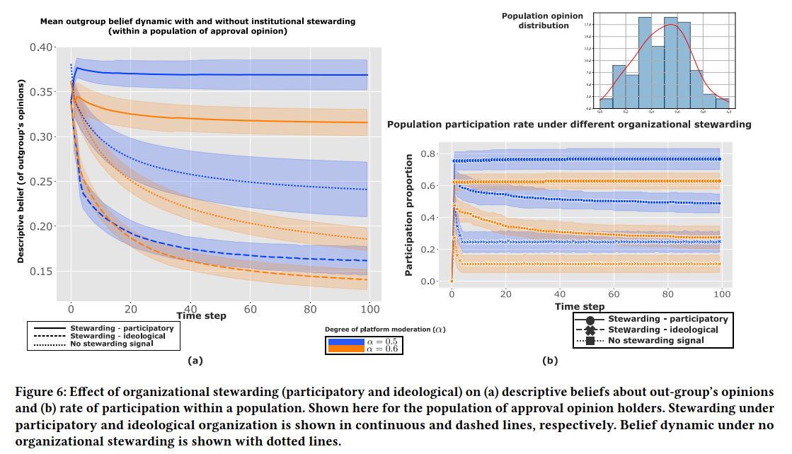

# Simulation for organizational stewarding

This simulation script allows users to execute the following simulations:
1. **Generate optimal signalling policy for participatory and ideological organizations**
2. **Simulate dynamic for community beliefs under a single organization's stewarding**
2. **Analyze community characterestics under heterogenous beliefs and stewarding by multiple organizations**

---

## How to Run

### **Prerequisites**
1. Setup the simulation parameters in constants.py under ```normative_information_design > normative_information_design_perceptiongap``` directory.


### **Usage**

1. **Generate optimal signalling policy**
   ```bash
   python .\normative_information_design\normative_information_design_perceptiongap\multiple_institution_stewarding_simulation.py single_institution
   python .\normative_information_design\normative_information_design_perceptiongap\show_plots.py single_institution_plots
    ```

2. **Simulate dynamic under single organizations**
   ```bash
   python .\normative_information_design\normative_information_design_perceptiongap\multiple_institution_stewarding_simulation.py single_institution
   python .\normative_information_design\normative_information_design_perceptiongap\show_plots.py single_institution_plots
    ```

3. **Simulate dynamic under multiple organizations**
   ```bash
   python .\normative_information_design\normative_information_design_perceptiongap\multiple_institution_stewarding_simulation.py multiple_institutions
   python .\normative_information_design\normative_information_design_perceptiongap\show_plots.py multiple_institutions_plot

---

### **Plots for optimal signalling**




### **Plots for single organization stewarding**

